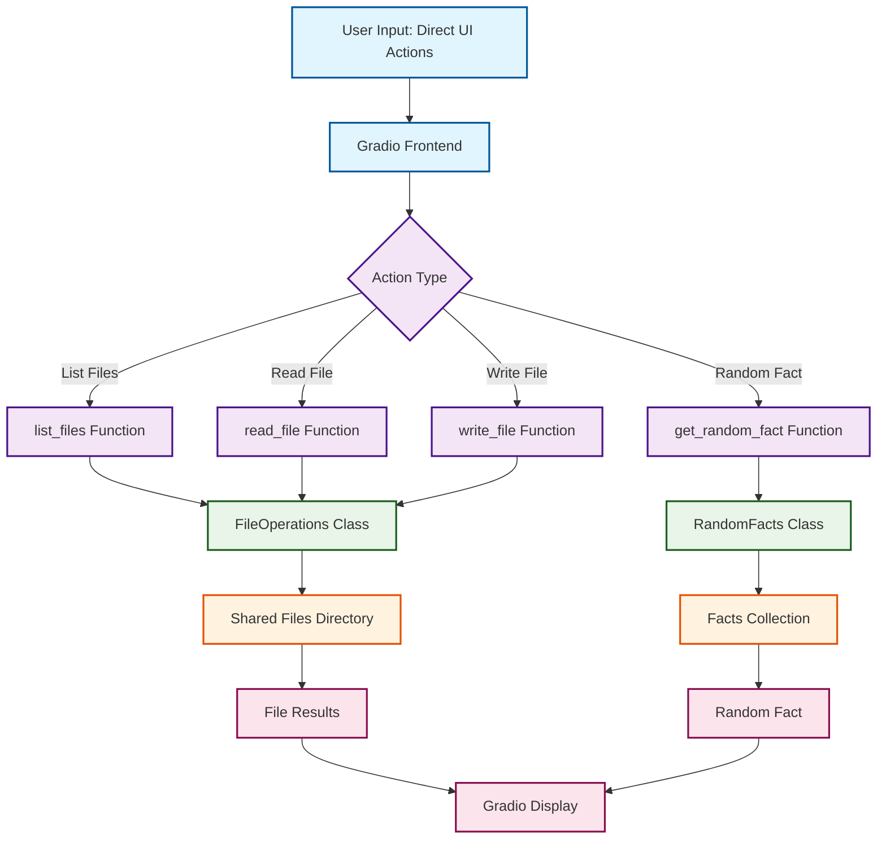

# Gradio Version - System Architecture Flow

## Interactive Flowchart

## Key Components

### User Interface Layer
- **User Input**: Direct UI interactions (button clicks, text inputs)
- **Gradio Frontend**: Single-page web interface with tabs and forms

### Function Layer
- **list_files Function**: Lists all files in the shared directory
- **read_file Function**: Reads content of a specific file
- **write_file Function**: Creates or modifies files
- **get_random_fact Function**: Returns a random fact

### Shared Components
- **FileOperations Class**: Same core file handling logic as MCP version
- **RandomFacts Class**: Same fact management as MCP version

### Data Storage
- **Shared Files Directory**: Common storage (same as MCP version)
- **Facts Collection**: Built-in facts array

### Data Flow
1. User interacts directly with UI components
2. Gradio calls appropriate function based on user action
3. Function uses shared components to perform operation
4. Result returned directly to Gradio interface
5. Result displayed to user

## Comparison with MCP Version

### Simplicity
- **No AI processing**: Direct function calls instead of natural language interpretation
- **No servers**: Single process instead of distributed architecture
- **No HTTP**: Direct function calls instead of API requests

### Shared Benefits
- **Same business logic**: Uses identical shared components
- **Same data**: Operates on the same files and facts
- **Same functionality**: Provides identical features

## Interactive Features (Future Enhancement)

This flowchart can be enhanced with:
- **Clickable boxes**: Each box could link to the corresponding code file
- **Animation**: Flow highlighting to show current execution path
- **Code popups**: Hover or click to show relevant code snippets
- **Live data**: Real-time status indicators for each component 