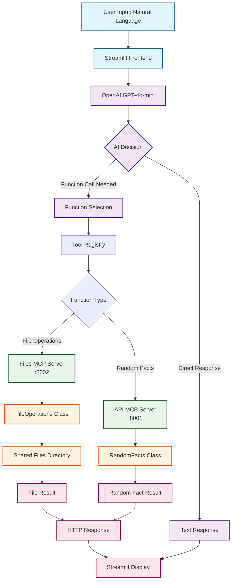

# MCP Version - System Architecture Flow

## Interactive Flowchart

## Key Components

### User Interface Layer
- **User Input**: Natural language requests like "Read the hydra-README.md file"
- **Streamlit Frontend**: Web interface that handles user interaction

### AI Processing Layer
- **OpenAI GPT-4o-mini**: Analyzes user intent and decides on function calls
- **Function Selection**: Maps natural language to specific MCP tools
- **Tool Registry**: Maintains mapping between function names and MCP servers

### Server Layer
- **Files MCP Server** (Port 8002): Handles file operations (list, read, write)
- **API MCP Server** (Port 8001): Provides random facts

### Shared Components
- **FileOperations Class**: Core file handling logic
- **RandomFacts Class**: Fact management and selection
- **Shared Files Directory**: Common storage for both implementations

### Data Flow
1. User enters natural language request
2. Streamlit sends request to OpenAI with available tools
3. AI decides which function to call and with what parameters
4. Request routed to appropriate MCP server
5. Server uses shared components to perform operation
6. Result returned through HTTP to Streamlit
7. Result displayed to user

## Interactive Features (Future Enhancement)

This flowchart can be enhanced with:
- **Clickable boxes**: Each box could link to the corresponding code file
- **Animation**: Flow highlighting to show current execution path
- **Code popups**: Hover or click to show relevant code snippets
- **Live data**: Real-time status indicators for each component 